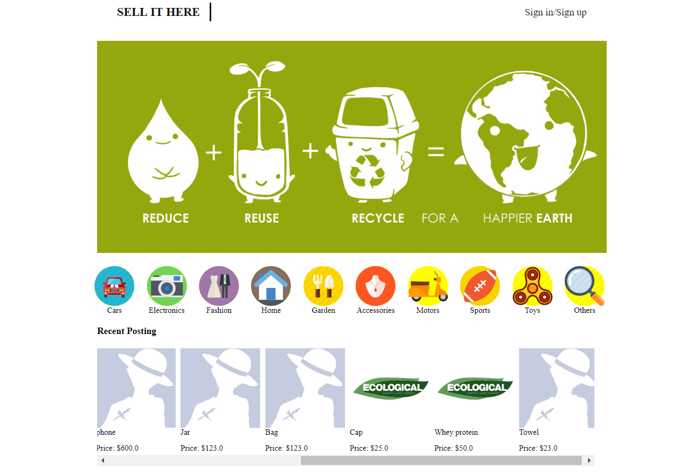
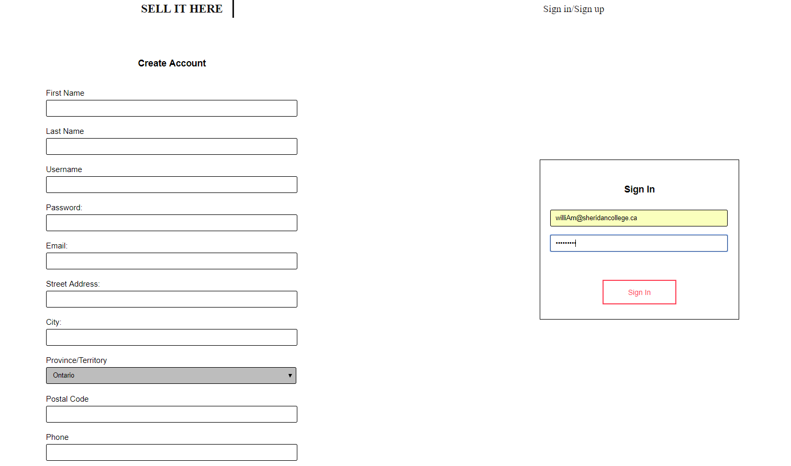
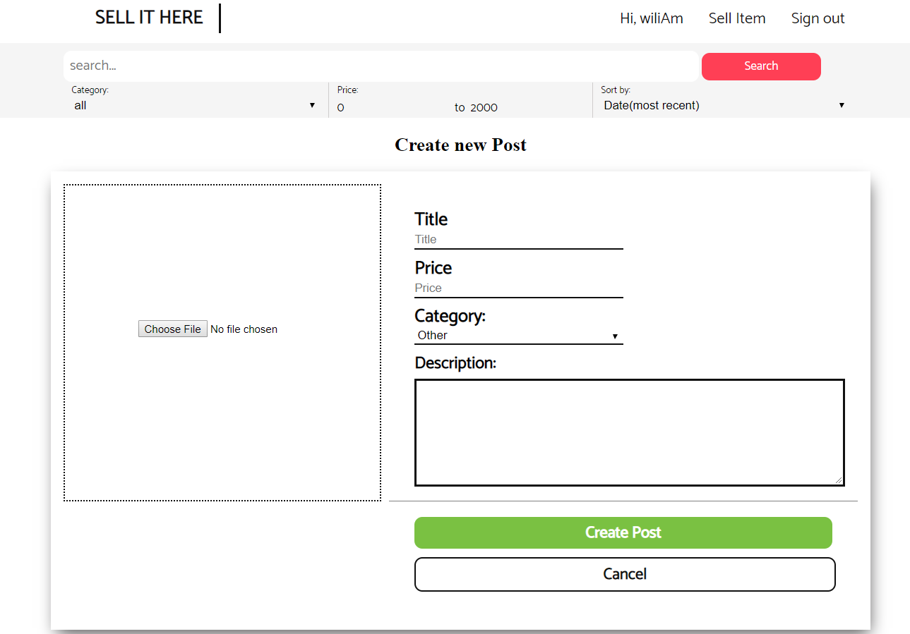
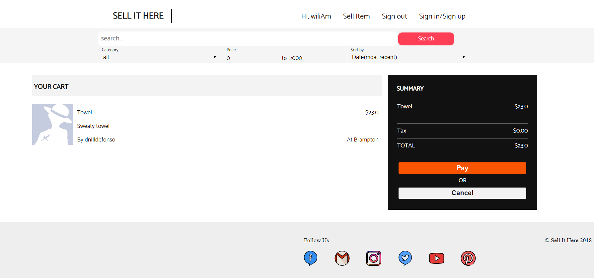
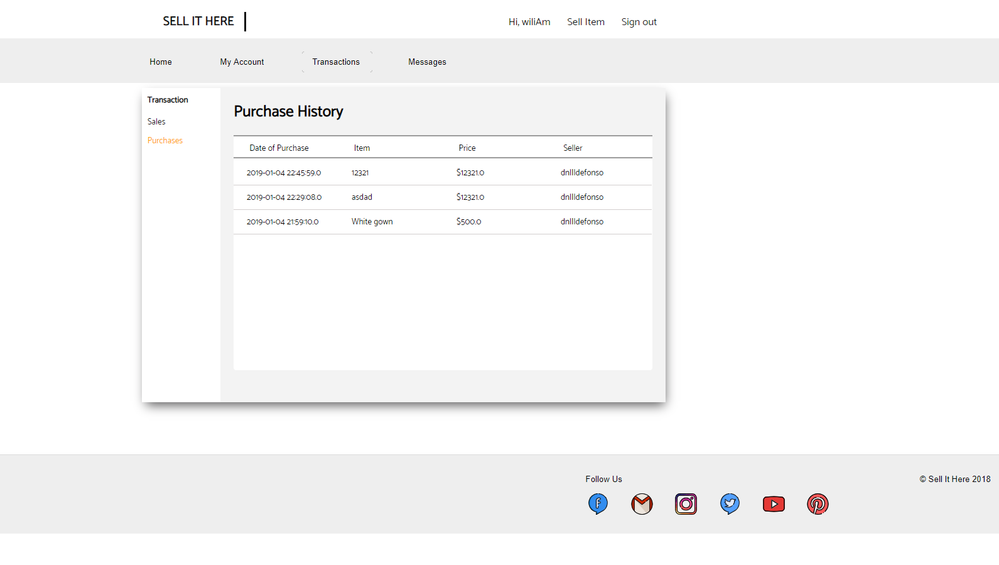

- Sell It Here is a web application which is created for the purpose of helping people advertise products.

  

- In order to post their product, they have to create an account.

  

- Once they created an account, they can sell or browse for a product they wanted to buy.

  *  Post product

  

  *  Buy a product

  

- They can check their transaction history, edit their profile, and view or reply to messages.

  

